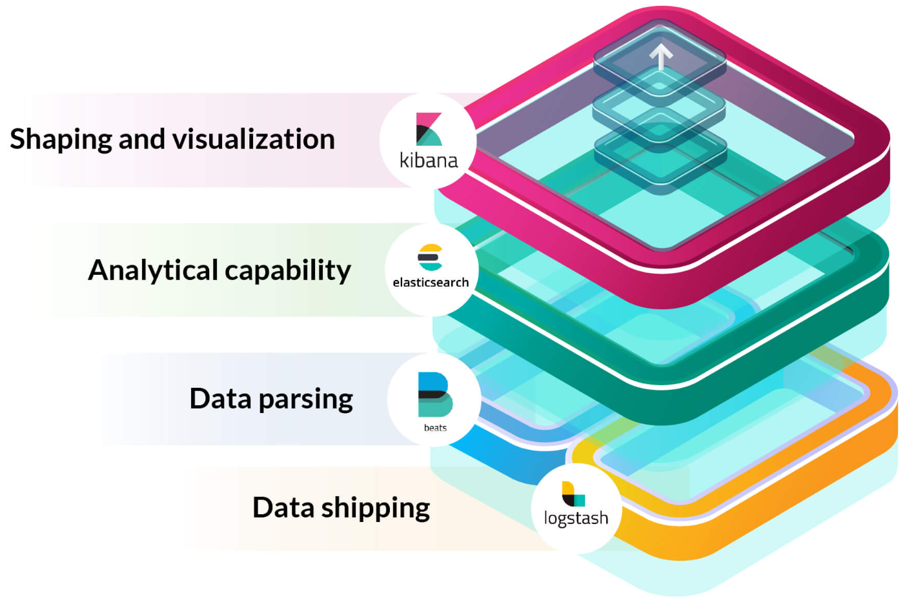
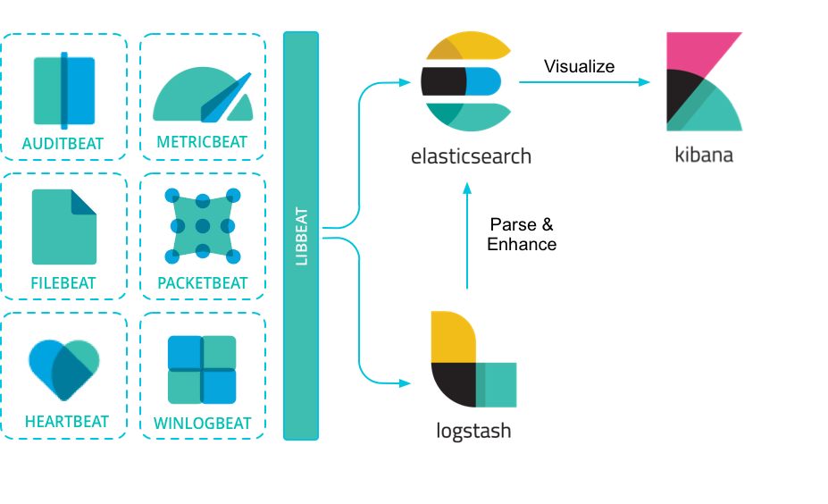
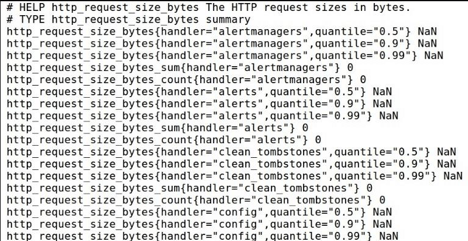
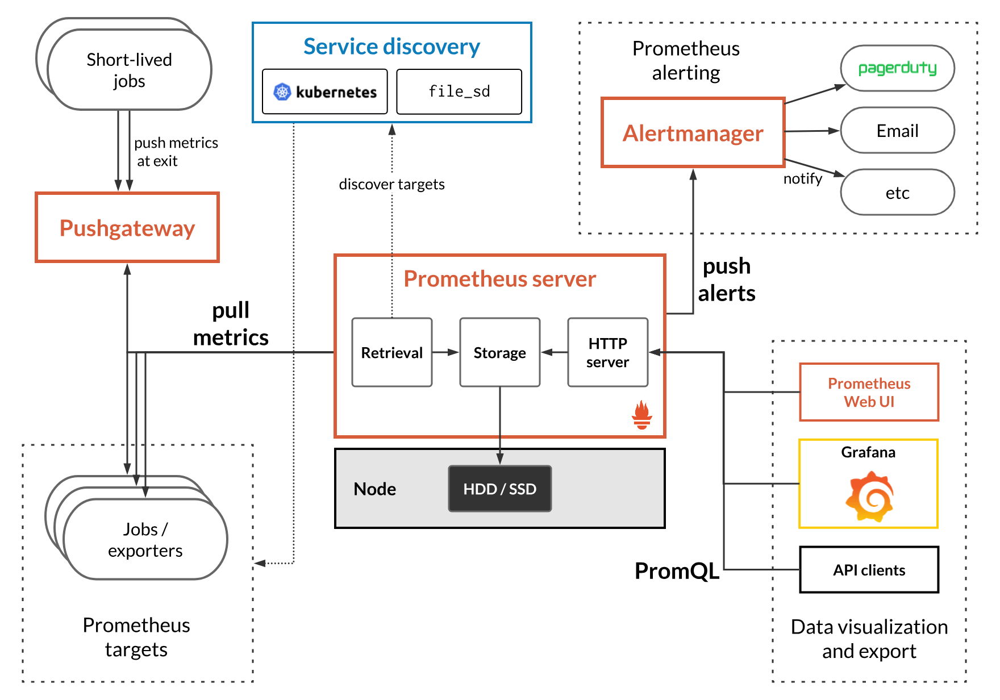

# Observabilidade

#### Tratando-se de aplicações distribuidas, colocar um aplicação no ar sem observabilidade é loucura!

---

### O que é OBSERVABILIDADE?
Na **teoria de controle**, a observabilidade é definida como uma medida de quão bem os estados internos de um sistema podem ser compreendidos/inferidos a partir do conhecimento das saídas externas desse sistema. 
Simplificando: observabilidade é quão bem você pode entender seu sistema complexo.

### Observabilidade vs Monitoramento
- Monitoramento nos mostra que há algo errado
- Monitoramento se baseia em saber com antecedência quais sinais você deseja monitorar
- Observabilidade nos permite perguntar o porquê algo esta dando errado.

### Os 3 pilares da observabilidade
- **Métricas** são numeros.
  - Métricas tecnicas
  - Métricas de negócio
- **Logs**
  - Resultados de eventos
  - O que está acontecendo com a aplicação
- **Tracing**
  - Capacidade de idenficar a ordem em que os eventos aconteceram
  - Identificar o erro e o contexto em que aconteceu
  - Capacidade de rastrear requisições entre microsserviços

### Elastic Stack

#### ELK Stack

- Elasticsearch
  - Search engine e analytics
  - Apache Lucene
  - 2010 - Elasticsearch N.V (Elastic)
  - Rápido
  - Escalável
  - Interface API Rest
  - Análise e visualização geoespacial
  - Application, website e enterprise search
  - Logging e analytics
  - Trabalha de forma distribuída através de shards que possuem redundância de dados.
  - Pode escalar milhares de servidores e manipular petabyte de dados

- Logstash
  - Processador de dados através de pipelines que consegue receber, transformar e enviar dados simultaneamente
  - Engine coletora de dados em tempo real
  - Inicio como manipulador de logs
  - Trabalha com pipelines
  - Recebe dados de múltiplas fontes
  - Normaliza a transforma dados
  - Envia dados para múltiplas fontes
  - Plugins

- Kibana
  - Permite usuários a visualizarem os dados do elasticsearch em diversas perspectivas
  - Ferramenta de visualização e exploração de dados
  - Usada com: Logs, Análise de séries, Monitoramento de aplicações, e inteligência operacional
  - Integração com Elasticsearch
  - Agregadores e filtragem de dados
  - Dashboards
  - Gráficos interativos
  - Mapas

### Beats e Elastic Stack

**Qual a diferença entre ELK Stack e Elastic Stack?**
ELK Stack + Beats = Elastic Stack



- Beats foi anunciado em 2015
- "Lightweight data shipper"
- Agente Coletor de dados
- Integrado facilmente com Elasticsearch ou Logstash
- Logs, Métricas, Network data, Audit Data, Uptime, Monitoring
- Você pode construir seu próprio Beat



### Elastic
- Empresa por trás das soluções
- Cloud Solution
- Oferecem plugins e recursos licenciados
- Produtos
  - APM
  - Maps
  - Site search
  - App Search
  - Infrastructure

### Iniciando com Elasticsearch e Kibana
https://www.elastic.co/pt/
https://github.com/elastic/examples

```bash
docker compose up -d
```

### Visão geral do Kibana

**Logs**
Centralize logs de qualquer fonte. Pesquise, siga, automatize a detecção de anomalias e visualize tendências para que você possa agir mais rapidamente.

**APM**
Rastreie transações por meio de uma arquitetura distribuída e mapeie as interações de seus serviços para identificar facilmente gargalos de desempenho.

**Metrics**
Analise métricas de sua infraestrutura, aplicativos e serviços. Descubra tendências, preveja comportamentos, receba alertas sobre anomalias e muito mais.

**Uptime**
Monitore proativamente a disponibilidade de seus sites e serviços. Receba alertas e resolva problemas mais rapidamente para otimizar a experiência de seus usuários.

### Metricbeat
Agente lightweight para métricas.

Colete métricas dos seus sistemas e serviços. Da CPU à memória, do Redis ao NGINX e muito mais, o Metricbeat é uma maneira leve de enviar estatísticas do sistema e dos serviços.

### Uptime e Heartbeat
Agente lightweight para monitoramento de tempo de atividade.

Monitore a disponibilidade dos serviços com sondagem ativa. Dada uma lista de URLs, o Heartbeat faz uma simples pergunta: você está vivo? O Heartbeat envia essa informação e o tempo de resposta para o restante

```bash
sudo chmod go-w heartbeat.yml
```

### APM - Elastic Stack
```yaml
  apm:
    image: docker.elastic.co/apm/apm-server-oss:7.13.0
    container_name: apm
    volumes:
      - ./apm/apm-server.yml:/usr/share/apm-server/apm-server.yml
    ports:
      - "8200:8200"
    restart: on-failure
    networks:
      - observability
```

```bash
sudo chmod 777 apm-server.yml
sudo chmod go-w apm-server.yml
sudo chown root apm-server.yml
```
Instalando APM
[Set up APM](https://www.elastic.co/guide/en/apm/guide/current/apm-quick-start.html#set-up-fleet-traces)

App que vai ser monitorado pelo APM Elastic
[./app](./app)

### Logs

[app/codeprogress/settings.py](app/codeprogress/settings.py)
```python
'handlers': {
    'elasticapm': {
        'level': 'WARNING',
        'class': 'elasticapm.contrib.django.handlers.LoggingHandler',
```

[app/exemplo/views.py](app/exemplo/views.py)
```python
import logging
logger = logging.getLogger('mysite')

logger.warning(
    'This is a warning!',
    exc_info=True
)
```

### Filebeat e Nginx
[./nginx](./nginx)

Precisa ser feito a instalação do filebeat no container do Nginx

Filebeat
[./nginx/filebeat.yml](./nginx/filebeat.yml)

### Elastic Cloud
https://www.elastic.co/pt/cloud/

https://observability-deployment.kb.us-east-1.aws.found.io:9243/app/home#/tutorial/nginxLogs

### Prometheus


- From metrics to insights.
- Power your metrics and alerting with a leading open-source monitoring solution.
- É um toolkit de monitoramento e alerta de sistema open-source
- Criado pela SoundCloud
- Faz parte da Cloud Native Computing Foundation
- Dados dimensionais
- Consultas poderosas
- Fácil visualização dos dados em conjunto com Grafana
- Storage eficiente
- Simples
- Alerta inteligente
- Diversidade de clients e integrações

#### Conceitos iniciais

#### Funcionamento
- **[Elastic Stack]** Um **agente** instalado na aplicação notifica constantemente o serviço monitor
- **[Prometheus]** O Serviço monitor busca as informações na aplicações

#### Coleta métricas via HTTP
[Prometheus] **--- (15s) pull via http --->** [Aplicação endpoint /metrics]
- Você adapta sua aplicação ao formato do prometheus



#### Dinâmica dos exporters

**Informações relevantes ao negócio**
- Quantidade de compras
- Tempo de resposta no processo de compra
- Quantidade de usuarios logados
- Utilização da feature x
- Busca especifica no site

**E quando não foi você quem desenvolveu?**
- MySQL
- Nginx / Apache
- Servidor Linux
- Etc...

#### Exporters
Um exportador atua como um proxy entre os aplicativos e o servidor Prometheus. Os exportadores usam um formato simples de chave-valor baseado em texto para coletar e expor métricas ao longo do tempo, via HTTP.

[Prometheus] **--- (15s) pull via http --->** [Exporter /metrics] **<-->** [Server Linux]

#### Arquitetura do Prometheus


##### Armazenamento
- TSDB (Time Series Database)
- Armazenamento de dados que mudam conforme o tempo
- Labels para propriedades especificas de uma determinada métrica (error_type=500)
- Otimização especifica para esse caso de uso, garantindo mais performance do que bancos de dados convencionais
- Quanto mais novo os dados, mais precisão

| Timestamp  | Erro 500 |                                       |
| ---------- | -------- | ------------------------------------- |
| 1569419430 | 12       | Até 1569419430 12 Erros               |
| 1569419436 | 15       | De 1569419430 Até 1569419436 15 Erros |
| 1569419450 | 17       | De 1569419436 Até 1569419450 17 Erros |


##### Métricas: Counter
- Valor incremental (Sempre)
- Prometheus consegue absorver falhas se, por algum motivo, esse número tenha um eventual reset
- Exemplo:
  - Quantidade de visitas em um site
  - Quantidade de vendas
  - Quantidade de erros

##### Métricas: Gauge
- Valor que pode possuir variações com o tempo
- Aumentar / Diminuir / Estabilizar
- Exemplo:
  - Qtd. usuários online
  - Qtd. servidores ativos

##### Métricas: Histogram
- Distribuição de frequência
- Medição é baseada em amostras
- Consegue agregar valores

##### Métricas: Summary
- Muito similar ao histogram
- Com summary os valores são calculados no servidor de aplicação não no prometheus
- Bom para aproximação de valores
- Ex.: request duration
- De forma geral, é muito mais comum utilizar histogram

##### PromQL
- Prometheus Query Language (SQL do Prometheus)
- Exemplo
  - http_requests_total
  - rate(http_requests_total[5m])
  - http_requests_total{status!~"4.."}
